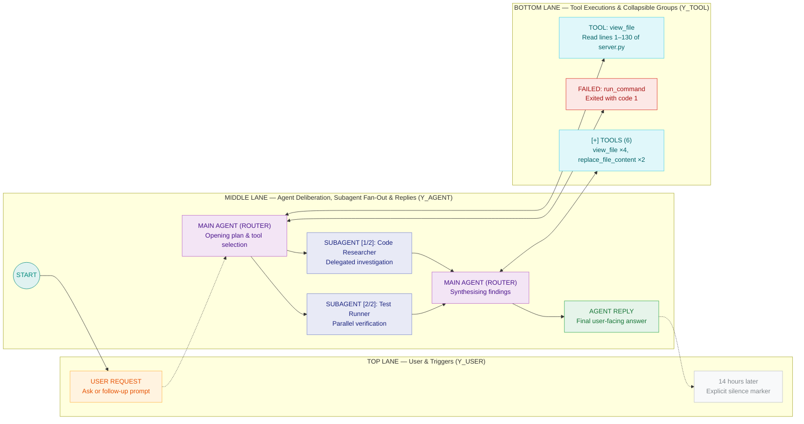
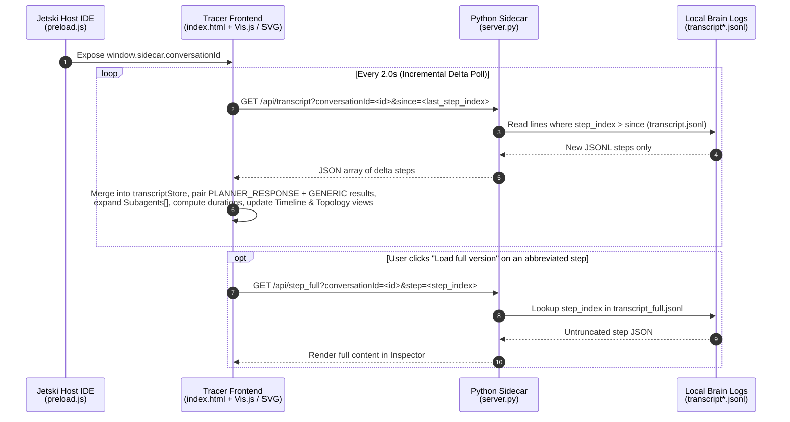

# Jetski Agent Tracer Plugin

[](#)
[-3776AB?style=flat-square&logo=python&logoColor=white)](#how-it-works)
[](#3-lane-swimlane-architecture)
[](#how-it-works)
[](#visual-node--status-legend)


A dynamic, LangGraph-style trajectory and architecture visualiser for Jetski. This UI plugin renders an agent's real-time workflow across **Timeline**, **Architecture**, and **Simplified** views—translating raw JSONL logs into plain English so both engineers and non-technical stakeholders can see **what was asked**, **how the agent planned**, **which tools and parallel subagents ran**, **where bottlenecks or errors occurred**, and **what was answered**.

---

## Quick Start & Installation

### 1. Clone the Plugin into Your Jetski Plugins Directory

Run the following commands in your terminal:

```bash
mkdir -p ~/.gemini/config/plugins
git clone https://github.com/elim316/Jetski-Agent-Tracer-Plugin.git ~/.gemini/config/plugins/agent-tracer
```

### 2. Enable the Plugin in Jetski

Enable `agent-tracer-plugin` using either of the following methods:

- **Via the Settings Menu:** Click **Settings** (the gear icon) in Jetski → navigate to **Customizations → Plugins** → locate **`agent-tracer-plugin`** and toggle it **ON**.
- **Via the `/plugin` Slash Command:** Type `/plugin` in the Jetski chat input (or ask Jetski: *"Enable the `agent-tracer-plugin` plugin"*).

### 3. Open the Agent Tracer Panel

Once enabled, open the live visualiser panel using any of the following methods:

- **Top-Right Sidecar / Panel Toggle:** Click the **Sidecar / Auxiliary Panel** button in the top-right header bar of the Jetski window and select the **Agent Tracer** tab.
- **One-Click Chat Pill:** Ask Jetski *"Open Agent Tracer"* (or paste `[Agent Tracer](sidecar://agent-tracer-plugin/tracer/)` in chat) to surface a one-click pill that opens the side panel directly.

### Updating

Agent Tracer includes **built-in self-updating**:

1. **Automatic Startup Sync:** When the sidecar starts (`server.py`), it checks whether your local plugin folder has uncommitted edits. If the working tree is clean, it automatically fetches and fast-forwards to the latest `origin/main` in the background.
2. **One-Click `Update (N)` Toolbar Button:** While the panel is open, Agent Tracer periodically checks `origin/main` (`/api/update-status`). Whenever new commits are pushed to GitHub, a green **`Update (N)`** pill appears in the top toolbar with a tooltip previewing the new commit titles. Clicking it updates the repository (`POST /api/update`) and reloads the panel in place.

> **NOTE:** To force-sync manually from a terminal, run:
>
> ```bash
> git -C ~/.gemini/config/plugins/agent-tracer fetch origin main && git -C ~/.gemini/config/plugins/agent-tracer reset --hard origin/main
> ```

---

## 3-Lane Swimlane Architecture

Every turn in a conversation is grouped into a translucent request band across three locked horizontal lanes (`Y_USER`, `Y_AGENT`, `Y_TOOL`):



---

## Visual Node & Status Legend

The following table summarises each node type, its swimlane placement, and the transcript condition that triggers it:

| Node / Badge | Swimlane | Visual Style | What Triggers It |
| :--- | :--- | :--- | :--- |
| **`USER REQUEST`** | Top (`Y_USER`) | Warm Orange (`#FFF3E0` / `#FFB74D`) | Every `USER_INPUT` step, stripped of `<ADDITIONAL_METADATA>` and `<CONTEXT_SUMMARY>` XML wrappers. |
| **`N hours later`** | Top (`Y_USER`) | Dashed Grey (`#BDC1C6`) | Inserted automatically before a user request when `≥ 6 hours` elapsed since the previous step. |
| **`MAIN AGENT (ROUTER)`** | Middle (`Y_AGENT`) | Purple (`#F3E5F5` / `#BA68C8`) | `PLANNER_RESPONSE` steps where the agent deliberates (`thinking`) or dispatches `tool_calls`. Centred directly above its child tool calls. |
| **`AGENT REPLY`** | Middle (`Y_AGENT`) | Emerald (`#E6F4EA` / `#34A853`) | Final `PLANNER_RESPONSE` steps that deliver a user-facing `content` answer with no further tool calls. |
| **`SUBAGENT [i/M]: <Role>`** | Middle (`Y_AGENT`) | Indigo (`#E8EAF6` / `#7986CB`) | `invoke_subagent` calls. Multi-agent batches (for example, 5 parallel subagents) fan out vertically in the middle lane and fan back in to the next router step. Double-click to drill into any subagent's own trajectory. |
| **`TOOL: <name>`** | Bottom (`Y_TOOL`) | Cyan (`#E0F7FA` / `#4DD0E1`) | Completed tool executions paired with their `GENERIC` output step. Steps with `≥ 4` tools arrange in a compact 2-row grid centred under their router. |
| **`[+] TOOLS (K)`** | Bottom (`Y_TOOL`) | Dashed Cyan (`#E0F7FA` / `#4DD0E1`) | Collapsed multi-tool bundle when **Collapse Tools** is active (or toggled per step). Click or double-click to expand. |
| **`RUNNING: <name>`** | Bottom (`Y_TOOL`) | Amber Dashed (`#FEF7E0` / `#F9AB00`) | In-flight tool or subagent calls waiting for their `GENERIC` result step to arrive. |
| **`FAILED: <name>`** | Bottom (`Y_TOOL`) | Crimson (`#FCE8E6` / `#D93025`) | Tool calls that reported a non-zero exit code, permission denial, or edit failure (`isFailure()`), plus `ERROR_MESSAGE` steps. |
| **`[Ns]`** | Bottom (`Y_TOOL`) | Slow Duration Tag on Node Title | Appended automatically whenever a tool call's wall-clock duration (`Completed At - Created At`) is `≥ 10s`. |
| **`CONTEXT CHECKPOINT`** | Middle (`Y_AGENT`) | Slate (`#E8EAED` / `#9AA0A6`) | `CHECKPOINT` steps where earlier conversation history was compacted by the runtime. |

---

## Features

### Three Synchronised Views (`Timeline` · `Architecture` · `Simplified`)

- **Timeline View:** 3-lane chronological swimlane graph (`Vis.js`) with centred 2-row tool grids, collapsible tool groups, and parallel multi-agent fan-out and fan-in.
- **Architecture View:** 3-column live system architecture diagram (`I/O Terminals` → `Planner Core` → `5 Capability Clusters & Tools`) with animated RPC particles, execution sequence badges, and up to 9 tool or subagent pills per cluster.
- **Simplified View:** Executive orbital view showing `User Prompt`, `Agent Output`, `Main Agent Core`, `Tool Set` ring, and `Subagents & Tasks` ring with live animated particles and dark/light theme synchronisation.

### Collapsible Tool Calls & Multi-Agent Fan-Out

- **Collapse Tools Toggle (`Collapse Tools` checkbox & per-step toggle):** Enable **Collapse Tools** in the toolbar to bundle any step with multiple tool calls into a single `[+] TOOLS (K)` node directly beneath its parent router, keeping the horizontal flow compact. You can also **double-click** any router, tool, or `[+] TOOLS (K)` node (or click **Collapse/Expand Tools on Graph** in the right-hand inspector) to expand or collapse tools for a single step on demand.
- **Parallel Multi-Agent Fan-Out (5+ Subagents) & Live Child Status:** When `invoke_subagent` launches multiple subagents concurrently, every subagent in `Subagents[]` is rendered as its own `SUBAGENT [i/M]: <Role>` node with vertical fan-out and fan-in edges in **Timeline View**, individual `sub:<Role>` pills in **Architecture View**, and individual orbital chips in **Simplified View**. Agent Tracer polls each child subagent's own transcript (`/api/subagents_status`) so you can see its live status, step count, tool count, and active tool (`[LIVE · 14 steps · 6 tools · code_search]`) directly on the parent graph and inspector cards without leaving the parent trace. Double-click any subagent node, pill, or chip (or click **Trace Subagent →** in the inspector) to inspect that subagent's full trajectory and navigate back via the session breadcrumb bar.

### Reading, Inspecting & Exporting the Trace

- **Plain-English inspector:** Click any node for a human-readable summary of what happened, stripped of internal XML envelopes (`<ADDITIONAL_METADATA>`, `<CONTEXT_SUMMARY>`).
- **Colour-coded file diffs:** Selecting any `replace_file_content` or `write_to_file` step in the inspector renders a colour-coded unified diff (`+` additions in green, `-` removals in red, with line-count badges) directly above the step details.
- **Model & token telemetry:** When connected to the local Jetski LanguageServer (`/api/telemetry`), the **Session Overview** surfaces the active model name, prompt token count, context-cache hit rate (`% cached`), output and thinking tokens, and estimated session cost.
- **Context-aware toolbar & pop-out tab (`↗`):** Switching to **Architecture** or **Simplified** view automatically replaces Timeline-only checkboxes with the **Scope (`This Turn` / `All Turns`)** switch in the header bar. Click **`↗`** in the top-right toolbar at any time to pop Agent Tracer out into a full browser tab.
- **Multi-format export (`Copy ▾`):** Click **`Copy ▾`** in the toolbar to copy the active turn as a structured **Markdown summary**, copy a **Mermaid `flowchart LR` diagram** of the turn, or download a **full `.json` trace snapshot** for offline analysis.
- **Result summaries & timing:** Every tool result opens with a one-line outcome headline, stat chips, and wall-clock duration. Click **Slow (>10s)** in the Session Overview (or press `s`) to rank the slowest calls.
- **Browsable failures:** Click **Issues** in the toolbar (or press `n`) to inspect every failed tool call or agent error with its request number and cause.
- **Search with match browser:** Filter by tool name, prompt, or thought text (including tools inside collapsed `[+] TOOLS (K)` groups). Step through hits with `‹` and `›` or click the hit counter to open the matches drawer.

---

## Keyboard Shortcuts

Press `?` in the top toolbar at any time to open the in-app shortcut legend. Shortcuts are ignored while typing in an input field, and clicking the graph canvas automatically releases focus from the search box:

| Key | Action |
| :--- | :--- |
| <kbd>←</kbd> / <kbd>→</kbd> | Jump to the **previous / next user request** |
| <kbd>/</kbd> | Focus the **Search trace** box |
| <kbd>Enter</kbd> / <kbd>Shift</kbd> + <kbd>Enter</kbd> | Step to the **next / previous search match** |
| <kbd>Esc</kbd> | Clear the active search filter |
| <kbd>v</kbd> | Cycle between **Timeline**, **Architecture**, and **Simplified** views |
| <kbd>i</kbd> | Toggle the right-hand **Inspector Panel** |
| <kbd>n</kbd> | Jump to the **next failed step** on the graph |
| <kbd>s</kbd> | Open the **Slowest Tool Calls (`≥ 10s`)** panel |
| <kbd>o</kbd> | Return to the **Session Overview** panel |
| <kbd>d</kbd> | Toggle **Dark / Light Mode** |
| <kbd>?</kbd> | Open the **Keyboard Shortcuts** legend |

---

## How It Works

Every time an agent takes a step in Jetski, the runtime appends a JSON record to the conversation's local log (`~/.gemini/jetski/brain/<conversation-id>/.system_generated/logs/transcript.jsonl`). Agent Tracer turns that stream into an interactive visual story in real time:



---

## Repository Structure

The repository is organised as follows:

```text
agent-tracer/
├── plugin.json                 # Jetski plugin manifest (name, version, sidecar mount)
├── README.md                   # Quick Start, enablement guide, architecture diagrams & legends
├── assets/
│   └── hero.png                # Banner graphic
└── sidecars/
    └── tracer/
        ├── sidecar.json        # Sidecar launcher config (runs python3 server.py)
        ├── server.py           # Zero-dependency HTTP server (/api/transcript, /api/conversations, /api/step_full)
        └── index.html          # Single-file Timeline (Vis.js), Architecture & Simplified SVG UI + Inspector
```

---

## Acknowledgements

The orbital layout in the Simplified view was inspired by the architecture visualiser in [isurusu/live-api-ecommerce](https://github.com/isurusu/live-api-ecommerce) by [@isurusu](https://github.com/isurusu).

